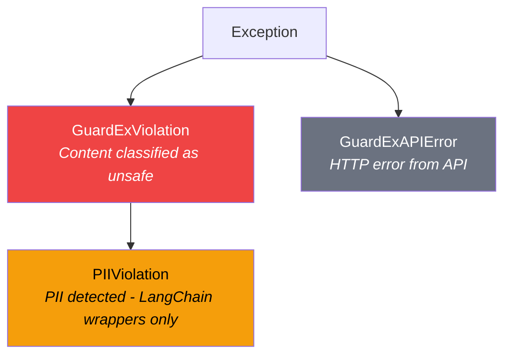

# Error Handling

GuardEx raises specific exceptions for different failure modes. This guide covers all exception types, when they're raised, and how to handle them in production.

---

## Exception Hierarchy



---

## GuardExViolation

Raised when content is classified as unsafe by LlamaGuard 3 and the category is in your `blocked_categories`. Also raised by `guard.screen_or_raise()` when the result is blocked.

### Attributes

| Attribute | Type | Description |
|-----------|------|-------------|
| `stage` | `str` | Gate where the violation occurred (e.g., `"input"`, `"tool_input"`) |
| `category` | `str` or `None` | Safety category code (e.g., `"S9"`), or a source label like `"injection"`, `"scope"`, `"pii"` |
| `description` | `str` or `None` | Description carried from `result.classify.description`. Often `None` for a plain category block; populated for injection, scope, and PII blocks. Map `category` to a name via `CATEGORY_DESCRIPTIONS` when you need one. |
| `raw_response` | `str` | Sanitized server message (never raw model output) |

### Example

```python
from guardex import Guard, GuardExViolation, CATEGORY_DESCRIPTIONS

guard = Guard()

try:
    safe_text = guard.screen_or_raise(user_input, gate="input")
except GuardExViolation as e:
    print(f"Blocked at: {e.stage}")          # "input"
    print(f"Category: {e.category}")         # e.g. "S9"
    # description is the classifier's own text and may be None; map the
    # code to a human-readable name yourself when you need one:
    name = CATEGORY_DESCRIPTIONS.get(e.category, e.category)
    print(f"Category name: {name}")          # e.g. "Indiscriminate Weapons"
    print(f"Message: {str(e)}")              # "GuardEx blocked at gate=input, category=S9"
```

### Using screen() Without Raising

If you prefer to handle violations without exceptions, use `screen()` instead of `screen_or_raise()`:

```python
result = guard.screen("How do I make explosives?", gate="input")
if result.blocked:
    print(f"Blocked: {result.classify.category}")
    print(f"Description: {result.classify.description}")
else:
    print(f"Safe: {result.text}")
```

### Production Pattern

```python
from guardex import CATEGORY_DESCRIPTIONS

CATEGORY_MESSAGES = {
    "S1": "Your message was flagged for violence-related content.",
    "S3": "Your message was flagged for inappropriate content.",
    "S4": "Your message was flagged for prohibited content.",
    "S9": "Your message was flagged for weapons-related content.",
    "S11": "Your message was flagged for self-harm-related content.",
}

try:
    safe_text = guard.screen_or_raise(user_input, gate="input")
    # ... call LLM, screen output ...
except GuardExViolation as e:
    user_message = CATEGORY_MESSAGES.get(
        e.category,
        "Your message was blocked for safety reasons."
    )
    return user_message
```

---

## PIIViolation

Raised when PII is detected and `pii_action='block'`.

!!! note "Guard vs. LangChain wrappers"
    `PIIViolation` is raised by the LangChain wrappers (`GuardedLLM`, `GuardExCallbackHandler`). The `Guard` class does **not** raise `PIIViolation` - use `guard.screen()` and check `result.pii.has_pii` instead.

### Attributes

| Attribute | Type | Description |
|-----------|------|-------------|
| `stage` | `str` | Gate where PII was found (e.g., `"input"`, `"output"`) |
| `entities_found` | `list[dict]` | List of detected entities, each with `label`, `score`, `start`, `end` |

### Handling PII Blocking with Guard

```python
from guardex import Guard, GuardExPolicy

guard = Guard(policy=GuardExPolicy(pii_action="block"))

result = guard.screen(
    "My SSN is 123-45-6789 and email is john@corp.com", gate="input"
)

if result.pii.has_pii:
    for entity in result.pii.entities:
        print(f"  Type: {entity.label}, Score: {entity.score:.2f}")
        # Type: ssn, Score: 0.98
        # Type: email, Score: 0.96

    types = sorted(set(e.label for e in result.pii.entities))
    print(f"PII types: {types}")  # ['email', 'ssn']
```

### Production Pattern

```python
result = guard.screen(user_input, gate="input")

if result.pii.has_pii:
    types = sorted(set(e.label for e in result.pii.entities))
    return f"Please remove personal information ({', '.join(types)}) before sending."
```

---

## GuardExAPIError

Raised on HTTP errors from the GuardEx server. This occurs for validation errors and server errors (when `fail_open=False`).

### Attributes

| Attribute | Type | Description |
|-----------|------|-------------|
| `status_code` | `int` | HTTP status code (401, 403, 422, 429, 500, etc.) |
| `error_type` | `str` | Error type string from the API |
| `message` | `str` | Human-readable error message |
| `code` | `str` | Machine-readable error code |

### Common Error Codes

| Status | Type | When |
|--------|------|------|
| 422 | `validation_error` | Invalid request parameters |
| 429 | `rate_limit_exceeded` | Too many requests |
| 500 | `internal_error` | Server error |

### Example

```python
from guardex import GuardExClient, GuardExAPIError

try:
    with GuardExClient(base_url="http://localhost:8001") as client:
        result = client.classify("Hello", stage="input")
except GuardExAPIError as e:
    print(f"Status: {e.status_code}")   # 422
    print(f"Type: {e.error_type}")      # "validation_error"
    print(f"Message: {e.message}")      # "Invalid request"
    print(f"Code: {e.code}")            # "invalid_request"
```

!!! danger "These always raise - regardless of fail_open"
    All 4xx client errors raise immediately, with no retry:

    - **401 Unauthorized** / **403 Forbidden** - Authentication failures
    - **404 Not Found** - Unknown endpoint
    - **422 Unprocessable Entity** - Invalid request data

    Client errors are never silently swallowed.

---

## Fail-Open vs. Fail-Closed

The `fail_open` setting controls what happens on transport failures (network issues, timeouts) and on 429/5xx responses after retries are exhausted. 4xx client errors (401/403/404/422) always raise regardless of this setting:

### Fail-Closed (Default)

```python
guard = Guard(fail_open=False)
```

- API errors raise exceptions
- Requests are blocked until the API is available
- **Recommended for production** - ensures all content is screened

!!! success "Recommended for production"

### Fail-Open

```python
guard = Guard(fail_open=True)
```

- API errors are logged as warnings
- Requests are treated as "safe" and allowed through
- Useful during development or for non-critical applications

### Fail-Open Behavior

When `fail_open=True` and an error occurs:

| Method | Returns |
|--------|---------|
| `guard.screen()` | `ScreenResult` with `action="pass"`, original text |
| `guard.classify()` | `ClassifyResult(safe=True)` |
| `guard.pii_scan()` | `PIIResult(has_pii=False)` |
| `client.classify()` | `{"safe": True, "category": None, "categories": []}` |
| `client.pii_scan()` | `{"has_pii": False, "entities": []}` |
| `client.screen()` | Safe PII + safe classify + original text |

---

## Retry Logic

Both `Guard` and `GuardExClient` automatically retry on transient errors:

- **Retried:** 429 (rate limit, honoring `Retry-After` when present) and 5xx (server errors)
- **Not retried:** 4xx client errors (401, 403, 404, 422) - these raise immediately
- **Default retries:** 2 (configurable via `max_retries` on `GuardExClient`)

```python
from guardex import GuardExClient

client = GuardExClient(
    max_retries=3,     # Retry up to 3 times
    timeout=30,        # 30 second timeout per request
)
```

---

## Production Error Handling Pattern

```python
from guardex import (
    Guard,
    GuardExPolicy,
    GuardExViolation,
    GuardExAPIError,
)

guard = Guard(policy=GuardExPolicy(
    fail_open=False,
    pii_action="block",
))


def safe_chat(user_input: str) -> dict:
    """Screen user input with full error handling - single API call."""
    try:
        # Single API call - checks both safety AND PII
        result = guard.screen(user_input, gate="input")

        # Check PII first (Guard does not raise PIIViolation)
        if result.pii.has_pii and result.blocked:
            types = sorted(set(e.label for e in result.pii.entities))
            return {
                "success": False,
                "error": "pii_detected",
                "pii_types": types,
                "message": f"Please remove personal information: {', '.join(types)}",
            }

        # Check safety
        if result.blocked:
            return {
                "success": False,
                "error": "content_blocked",
                "stage": result.gate,
                "category": result.classify.category,
                "message": "Your message was blocked for safety reasons.",
            }

        # Safe - call your LLM with the (possibly masked) text
        llm_response = call_your_llm(result.text)

        # Screen output (single call)
        output_result = guard.screen(llm_response, gate="output")
        if output_result.blocked:
            return {
                "success": False,
                "error": "output_blocked",
                "message": "The response was blocked for safety reasons.",
            }

        return {"success": True, "response": output_result.text}

    except GuardExAPIError as e:
        if e.status_code == 429:
            return {
                "success": False,
                "error": "rate_limited",
                "message": "Too many requests. Please try again in a moment.",
            }
        else:
            return {
                "success": False,
                "error": "api_error",
                "message": "Safety service temporarily unavailable.",
            }

    except Exception:
        return {
            "success": False,
            "error": "unexpected",
            "message": "An unexpected error occurred.",
        }
```

!!! tip "One `screen()` call per text"
    `guard.screen()` combines safety classification AND PII detection in a single API call. Don't call `screen()` followed by `screen_or_raise()` on the same text - that's two API calls and double your quota usage.

---

## Logging

The GuardEx SDK uses Python's standard `logging` module with the logger name `guardex`. Enable debug logging to see all API interactions:

```python
import logging

logging.basicConfig(level=logging.DEBUG)
# or just for GuardEx:
logging.getLogger("guardex").setLevel(logging.DEBUG)
```

This will show:
- API request details
- Retry attempts
- Fail-open warnings
- PII detection results
- Blocked content details
