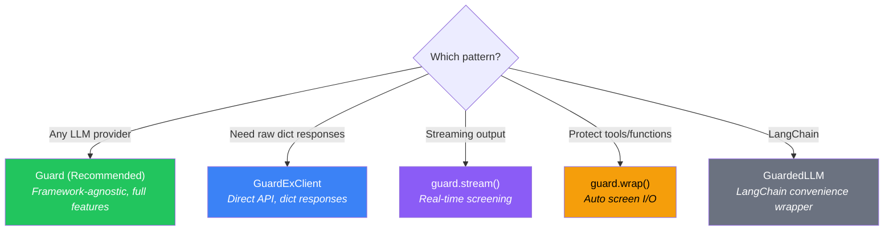

# Integration Patterns

GuardEx is framework-agnostic. The `Guard` class works with any LLM provider. Choose the pattern that fits your application.



---

## Pattern 1: Guard (Recommended)

**Best for:** Any application, any LLM provider. This is the primary interface.

`Guard` returns typed `ScreenResult` objects with `.safe`, `.blocked`, `.text`, `.classify`, `.pii`, `.scope`, and `.request_id` attributes.

### Basic Usage

```python
from guardex import Guard

guard = Guard()

# Screen and get a result object
result = guard.screen("user input", gate="input")
if result.safe:
    print(result.text)       # possibly PII-masked text
elif result.blocked:
    print(result.classify.category)  # S-code, e.g. "S9" (or "injection", "scope")

# Or raise automatically on violations
safe_text = guard.screen_or_raise("user input", gate="input")
```

### With Context-Aware Policy

```python
from guardex import Guard, GuardExContext, DeploymentContext, UserContext, Region, Industry

guard = Guard()

# Context automatically adjusts policy per deployment/region/industry
ctx = GuardExContext(
    deployment=DeploymentContext.PRODUCTION,
    user=UserContext(region=Region.EU, industry=Industry.HEALTHCARE),
)

# EU + Healthcare context adds GDPR/HIPAA PII entities, lowers thresholds
result = guard.screen("patient record #12345", gate="input", context=ctx)
```

!!! info "All Guard methods accept `context=`"
    `screen()`, `screen_or_raise()`, `classify()`, `pii_scan()`, `pii_mask()`, `screen_batch()`, `stream()`, and all async variants accept an optional `context` parameter. See [Context-Aware Policy](context-aware-policy.md) for details.

!!! note "When to use `screen()` vs `screen_or_raise()`"
    - **`screen_or_raise()`** - Raises `GuardExViolation` on unsafe content. Returns clean text. Best for simple flows where you just need safe text.
    - **`screen()`** - Returns a `ScreenResult` object. Never raises on content issues. Best when you need to inspect PII details, check `pii_action="block"`, or access latency metrics.

    Start with `screen_or_raise()`. Switch to `screen()` when you need more control.

### With OpenAI

```python
from openai import OpenAI
from guardex import Guard

guard = Guard()
client = OpenAI()

safe_input = guard.screen_or_raise(user_message, gate="input")

response = client.chat.completions.create(
    model="gpt-4o",
    messages=[{"role": "user", "content": safe_input}],
)

safe_output = guard.screen_or_raise(
    response.choices[0].message.content, gate="output"
)
```

### With Anthropic

```python
import anthropic
from guardex import Guard

guard = Guard()
client = anthropic.Anthropic()

safe_input = guard.screen_or_raise(user_message, gate="input")

message = client.messages.create(
    model="claude-sonnet-4-6",
    max_tokens=1024,
    messages=[{"role": "user", "content": safe_input}],
)

safe_output = guard.screen_or_raise(message.content[0].text, gate="output")
```

### With LangChain

```python
from langchain_openai import ChatOpenAI
from guardex import Guard

guard = Guard()
llm = ChatOpenAI(model="gpt-4o")

safe_input = guard.screen_or_raise(user_message, gate="input")
response = llm.invoke(safe_input)
safe_output = guard.screen_or_raise(response.content, gate="output")
```

### With Policy Configuration

```python
from guardex import Guard, GuardExPolicy

policy = GuardExPolicy(
    blocked_categories=["S1", "S3", "S4", "S9", "S11"],
    pii_enabled=True,
    pii_action="mask",
    pii_threshold=0.7,
    fail_open=False,
)

guard = Guard(policy=policy)
```

### Individual Methods

```python
# Safety classification only (no PII)
result = guard.classify("some text", gate="input")
print(result.safe, result.category)

# PII scan only (detection without masking)
result = guard.pii_scan("My email is test@example.com")
print(result.has_pii, result.entities)

# PII mask only (detection + replacement)
masked = guard.pii_mask("My email is test@example.com")
print(masked)  # "My email is [EMAIL]"
```

### Context Manager

```python
with Guard() as guard:
    result = guard.screen("Hello", gate="input")
# HTTP client automatically closed
```

### Async

```python
async with Guard() as guard:
    result = await guard.ascreen("Hello", gate="input")
    safe_text = await guard.ascreen_or_raise("Hello", gate="input")
```

### 8 Screening Gates

`Guard` supports 8 gate positions in your LLM pipeline:

| Gate | Purpose | When to use |
|------|---------|-------------|
| `input` | User prompt | Before sending to LLM |
| `output` | LLM response | Before returning to user |
| `prompt` | Assembled prompt | After combining system + user messages |
| `stream` | Streaming chunks | During token-by-token generation |
| `tool_input` | Tool/function arguments | Before executing a tool |
| `tool_output` | Tool return value | Before feeding result back to agent |
| `retrieval_query` | Vector store query | Before hitting the retrieval system |
| `retrieval_result` | Retrieved documents | Before injecting into context |

```python
# User input
safe_input = guard.screen_or_raise(user_msg, gate="input")

# Tool arguments
safe_args = guard.screen_or_raise(tool_args, gate="tool_input")

# Retrieved documents
for doc in retrieved_docs:
    result = guard.screen(doc, gate="retrieval_result")
    if result.safe:
        context.append(result.text)
```

!!! tip "Which gates do I need?"
    For most applications, **`input` and `output` are sufficient**. Add more gates only as your architecture requires them:

    - **Simple chatbot:** `input` + `output`
    - **Streaming chatbot:** `input` + `guard.stream()` for output
    - **Agent with tools:** Add `tool_input` + `tool_output`
    - **RAG pipeline:** Add `retrieval_query` + `retrieval_result`

---

## Pattern 2: Streaming

**Best for:** Screening LLM responses as they stream, token by token.

`guard.stream()` buffers chunks and screens at sentence boundaries (`.`, `!`, `?`) or when the buffer exceeds a threshold. If unsafe content is detected mid-stream, a `GuardExViolation` is raised immediately.

### Sync Streaming

```python
from openai import OpenAI
from guardex import Guard

guard = Guard()
client = OpenAI()


def openai_chunks():
    stream = client.chat.completions.create(
        model="gpt-4o",
        messages=[{"role": "user", "content": "Tell me a story"}],
        stream=True,
    )
    for chunk in stream:
        delta = chunk.choices[0].delta.content
        if delta:
            yield delta


for safe_chunk in guard.stream(openai_chunks(), gate="output"):
    print(safe_chunk, end="", flush=True)
```

### Async Streaming

```python
from guardex import Guard

guard = Guard()


async def anthropic_chunks():
    async with client.messages.stream(...) as stream:
        async for text in stream.text_stream:
            yield text


async for safe_chunk in guard.astream(anthropic_chunks(), gate="output"):
    print(safe_chunk, end="", flush=True)
```

### Buffer Configuration

```python
# Flush every 128 characters instead of default 256
for chunk in guard.stream(chunks, gate="output", flush_every=128):
    print(chunk, end="", flush=True)
```

---

## Pattern 3: Function Wrapping

**Best for:** Protecting tool/function calls in agent pipelines.

`guard.wrap()` returns a new callable that screens both the input and output of any function.

```python
import json
from guardex import Guard

guard = Guard()


def search_web(query: str) -> str:
    return json.dumps({"results": [f"Result for: {query}"]})


def calculate(expression: str) -> str:
    return str(eval(expression))  # demo only


# Wrap tools - screens input (tool_input) AND output (tool_output)
safe_search = guard.wrap(search_web, gate="tool_input", screen_output=True)
safe_calc = guard.wrap(calculate, gate="tool_input", screen_output=True)

# PII in args gets masked, unsafe outputs get blocked
result = safe_search("find public records for John Smith")
print(result)
```

---

## Pattern 4: GuardExClient (Direct API)

**Best for:** When you want raw `dict` responses instead of typed objects, or need low-level control.

```python
from guardex import GuardExClient

with GuardExClient(base_url="http://localhost:8001") as client:
    # Combined PII + classification - returns (result, request_id)
    result, request_id = client.screen("My SSN is 123-45-6789", stage="input")
    print(result["pii"]["has_pii"])       # True
    print(result["classify"]["safe"])     # True
    print(result["text"])                 # "My SSN is [SSN]"

    # Safety classification only
    result = client.classify("Some text", stage="input")
    print(result["safe"])

    # PII scan only
    result = client.pii_scan("Call me at 555-0123")
    print(result["entities"])

    # PII mask only
    result = client.pii_mask("Email: alice@secret.com")
    print(result["masked_text"])

    # Health check
    print(client.health())
```

### Async Client

```python
from guardex import AsyncGuardExClient

async with AsyncGuardExClient(base_url="http://localhost:8001") as client:
    result, request_id = await client.screen("Hello", stage="input")
```

---

## Pattern 5: Agent Loop

**Best for:** Multi-step agents that call tools, process results, and need safety screening at every step.

```python
from guardex import Guard

guard = Guard()


def agent_loop(user_input: str, max_steps: int = 5) -> str:
    # G1: Screen user input
    safe_input = guard.screen_or_raise(user_input, gate="input")

    context = safe_input
    for step in range(max_steps):
        tool_call = decide_tool(context)

        # G5: Screen tool input
        safe_tool_input = guard.screen_or_raise(tool_call, gate="tool_input")

        # Execute tool
        tool_result = execute_tool(safe_tool_input)

        # G6: Screen tool output
        safe_result = guard.screen_or_raise(tool_result, gate="tool_output")
        context = safe_result

        if is_done(context):
            break

    # G4: Screen final response
    return guard.screen_or_raise(context, gate="output")
```

---

## Pattern 6: RAG Pipeline

**Best for:** Retrieval-augmented generation with safety at every stage.

```python
from guardex import Guard

guard = Guard()


def guarded_rag(user_query: str, documents: list[str]) -> str:
    # Screen query before retrieval
    safe_query = guard.screen_or_raise(user_query, gate="retrieval_query")

    # Retrieve documents (your vector store here)
    retrieved_docs = vector_store.similarity_search(safe_query, k=5)

    # Screen each retrieved document
    safe_docs = []
    for doc in retrieved_docs:
        result = guard.screen(doc, gate="retrieval_result")
        if result.safe:
            safe_docs.append(result.text)  # PII-masked text

    # Screen assembled prompt
    context = "\n".join(safe_docs)
    prompt = f"Context:\n{context}\n\nQuestion: {safe_query}\nAnswer:"
    safe_prompt = guard.screen_or_raise(prompt, gate="prompt")

    # LLM call
    llm_response = call_your_llm(safe_prompt)

    # Screen final output
    return guard.screen_or_raise(llm_response, gate="output")
```

---

## Pattern 7: LangChain wrappers

!!! note "Use Guard outside LangChain"
    `GuardedLLM` and `GuardExCallbackHandler` wrap LangChain models; use the `Guard` class directly outside LangChain. See [Choosing Your Setup](migration.md).

### GuardedLLM

```python
# pip install guardex-ai[langchain]
from guardex import GuardedLLM
from langchain_openai import ChatOpenAI

llm = GuardedLLM(ChatOpenAI(model="gpt-4o-mini"))
response = llm.invoke("Tell me a joke")
```

### GuardExCallbackHandler

```python
# pip install guardex-ai[langchain]
from guardex import GuardExCallbackHandler
from langchain_openai import ChatOpenAI

handler = GuardExCallbackHandler()
llm = ChatOpenAI(model="gpt-4o-mini", callbacks=[handler])
response = llm.invoke("Hello!")
```

---

## Comparison Matrix

| Feature | Guard | GuardExClient | Streaming | Wrap | GuardedLLM |
|---------|-------|--------------|-----------|------|------------|
| Framework-agnostic | Yes | Yes | Yes | Yes | LangChain only |
| Typed results | `ScreenResult` | `dict` | yields `str` | `str` | `AIMessage` |
| PII masking | Yes | Yes | Yes | Yes | Yes |
| Safety classification | Yes | Yes | Yes | Yes | Yes |
| Streaming support | via `.stream()` | No | Native | No | No |
| Async support | Yes | Yes | Yes | No | No |
| 8 gate types | Yes | 2 stages | Yes | Yes | 2 stages |
| Context manager | Yes | Yes | N/A | N/A | No |
| Dependencies | `httpx` | `httpx` | `httpx` | `httpx` | `langchain-core` |
