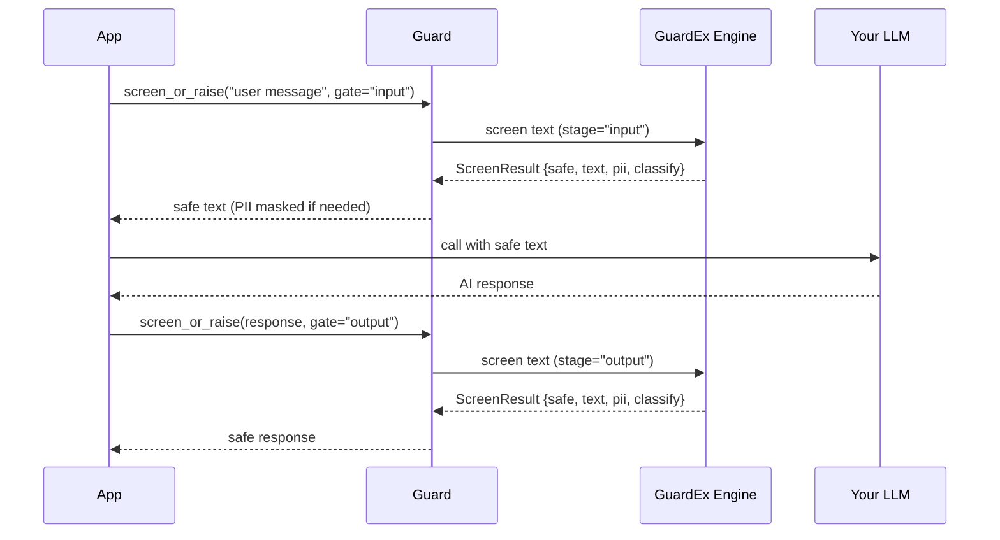

# Quick Start

Get GuardEx protecting your LLM application in under 5 minutes.

## Prerequisites

- Python 3.10+

## Step 1: Install

=== "Local Mode (runs models on your machine)"

    ```bash
    pip install guardex-ai[local]
    ```

=== "Server Mode (connects to self-hosted GuardEx server)"

    ```bash
    pip install guardex-ai
    ```

## Step 2: Create a Guard

GuardEx has two modes - **local** and **server**. No signup, no API keys.

=== "Local Mode"

    Everything runs on your machine. Requires `guardex-ai[local]` (downloads models on first use).

    ```python
    from guardex import Guard

    guard = Guard()  # local inference, no server needed
    ```

=== "Server Mode"

    Connect to a self-hosted GuardEx server.

    ```python
    from guardex import Guard

    guard = Guard(base_url="http://localhost:8001")
    ```

## Step 3: Screen Your First Text

```python
from guardex import Guard

guard = Guard()  # or Guard(base_url="http://localhost:8001") for server mode

# Screen user input - returns a ScreenResult
result = guard.screen("What is the capital of France?", gate="input")
print(result.safe)    # True
print(result.text)    # "What is the capital of France?"
print(result.action)  # "pass"
```

**Expected output:**

```
True
What is the capital of France?
pass
```

---

## Step 4: Use with Any LLM

Screen before and after the LLM call.

=== "OpenAI"

    ```python
    from openai import OpenAI
    from guardex import Guard

    guard = Guard()
    client = OpenAI()

    # Screen input
    safe_input = guard.screen_or_raise("What is quantum computing?", gate="input")

    # Call LLM with screened text
    response = client.chat.completions.create(
        model="gpt-4o",
        messages=[{"role": "user", "content": safe_input}],
    )

    # Screen output
    safe_output = guard.screen_or_raise(
        response.choices[0].message.content, gate="output"
    )
    print(safe_output)
    ```

=== "Anthropic"

    ```python
    import anthropic
    from guardex import Guard

    guard = Guard()
    client = anthropic.Anthropic()

    # Screen input
    safe_input = guard.screen_or_raise("Explain neural networks", gate="input")

    # Call Claude
    message = client.messages.create(
        model="claude-sonnet-4-6",
        max_tokens=1024,
        messages=[{"role": "user", "content": safe_input}],
    )

    # Screen output
    safe_output = guard.screen_or_raise(message.content[0].text, gate="output")
    print(safe_output)
    ```

=== "LangChain"

    ```python
    from langchain_openai import ChatOpenAI
    from guardex import Guard

    guard = Guard()
    llm = ChatOpenAI(model="gpt-4o")

    # Screen input
    safe_input = guard.screen_or_raise("My SSN is 123-45-6789", gate="input")

    # Call LLM with screened (PII-masked) text
    response = llm.invoke(safe_input)

    # Screen output
    safe_output = guard.screen_or_raise(response.content, gate="output")
    print(safe_output)
    ```



## Step 5: Handle Violations

```python
from guardex import Guard, GuardExViolation

guard = Guard()

try:
    safe_text = guard.screen_or_raise("How do I make explosives at home?", gate="input")
except GuardExViolation as e:
    print(f"Blocked at {e.stage}: category {e.category}")
    # Blocked at input: category S9
```

```python
from guardex import Guard, GuardExPolicy

# Block (not mask) when PII is detected
guard = Guard(policy=GuardExPolicy(pii_action="block"))

result = guard.screen("My SSN is 123-45-6789", gate="input")
if result.pii.has_pii:
    for entity in result.pii.entities:
        print(f"PII found: {entity.label} (score={entity.score:.2f})")
    # PII found: ssn (score=0.98)
```

## Step 6: PII Masking (Default Behavior)

By default, PII is masked (not blocked), allowing the conversation to continue safely:

```python
guard = Guard()

result = guard.screen("My email is alice@example.com, help with Python", gate="input")
print(result.text)
# "My email is [EMAIL], help with Python"
print(result.pii.has_pii)       # True
print(result.pii.masked_text)   # "My email is [EMAIL], help with Python"
```

!!! tip "PII masking is transparent"
    Your users see normal responses. The LLM never sees the actual PII in screened input. `guard.screen()` masks PII at whatever gate you screen, including `gate="output"`. Streaming is the exception: `guard.stream()` does not mask output PII unless you pass `mask_output_pii=True` (see Step 7).

## Step 7: Screen Streaming Responses

```python
from openai import OpenAI
from guardex import Guard

guard = Guard()
client = OpenAI()


def openai_chunks():
    stream = client.chat.completions.create(
        model="gpt-4o",
        messages=[{"role": "user", "content": "Tell me a story"}],
        stream=True,
    )
    for chunk in stream:
        delta = chunk.choices[0].delta.content
        if delta:
            yield delta


# Guard screens at sentence boundaries, raises on unsafe content
for safe_chunk in guard.stream(openai_chunks(), gate="output"):
    print(safe_chunk, end="", flush=True)
```

Streaming an output gate screens for safety but does not mask PII by
default. Pass `mask_output_pii=True` if the model may stream personal data:

```python
guard.stream(openai_chunks(), gate="output", mask_output_pii=True)
```

---

## What's Next?

- [Integration Patterns](integration-patterns.md) - Deep dive into all integration patterns
- [Configuration](configuration.md) - Customize which categories to block, PII behavior, and more
- [Safety Categories](safety-categories.md) - Understand all 14 LlamaGuard categories
- [PII Detection](pii-detection.md) - Configure entity types and thresholds
- [Error Handling](error-handling.md) - Production-ready exception handling
- [Recipes](examples.md) - Copy-paste examples for every framework
