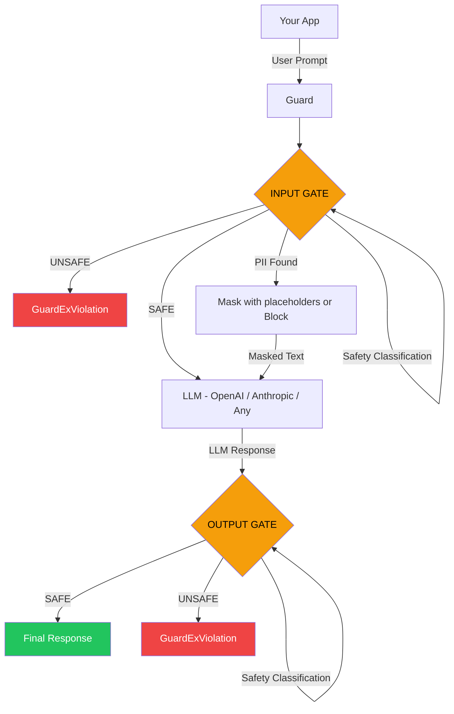
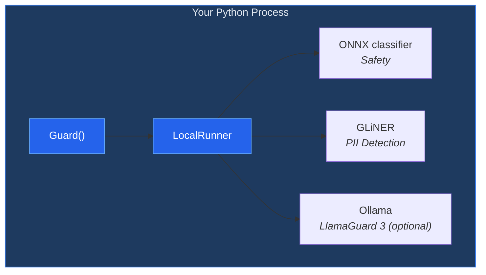

# GuardEx Documentation

**AI guardrails for any LLM framework - content classification + PII detection, runs in-process.**

GuardEx screens every LLM prompt and response for unsafe content and personally identifiable information (PII). It works with any LLM provider - OpenAI, Anthropic, Google, HuggingFace, LiteLLM, or your own custom model. No framework lock-in. All screening runs in your own process; no data leaves it.

```python
from guardex import Guard

# Local in-process mode (requires: pip install 'guardex-ai[local]')
guard = Guard()
result = guard.screen("user input", gate="input")
if result.blocked:
    print(f"Blocked: {result.classify.category}")
```



If **UNSAFE** at either gate, GuardEx raises `GuardExViolation(stage, category)`.
If **PII found** with `pii_action="mask"` (default), the text is sanitized with `[LABEL]` placeholders before continuing. With `pii_action="block"`, the `ScreenResult` has `blocked = True` - use `guard.screen()` to inspect.

---

## Why GuardEx?

- **Framework-agnostic** - Works with OpenAI, Anthropic, LangChain, LlamaIndex, CrewAI, LiteLLM, or raw HTTP calls. No framework lock-in.
- **Runs in-process** - `Guard()` runs all ML in your Python process. No external API calls for screening, no telemetry, no accounts. Models download from Hugging Face on first use, then run offline.
- **8 screening gates** - Screen user input, LLM output, tool I/O, retrieval queries/results, assembled prompts, and streaming chunks.
- **Streaming support** - Screen streaming responses at sentence boundaries with `guard.stream()`.
- **Function wrapping** - Wrap any callable with `guard.wrap()` for automatic input/output screening.
- **Full async** - Every method has an async counterpart (`ascreen`, `astream`, etc.).
- **14 safety categories** - LlamaGuard 3 taxonomy covering violence, exploitation, weapons, self-harm, and more. The per-category LlamaGuard layer is optional and requires [Ollama](https://ollama.com/); without it, the binary ONNX classifier runs.
- **31 PII entity types** - Detect and mask emails, phone numbers, SSNs, credit cards, API keys, and more.
- **Policy management** - Configure policies in code with `GuardExPolicy` and `TopicScope`.
- **Typed results** - `ScreenResult`, `ClassifyResult`, `PIIResult`, `GroundingResult` dataclasses with `.safe`, `.blocked`, `.hallucinated` properties.
- **Grounding & hallucination detection** - Opt-in check that verifies LLM responses are faithful to source documents using NLI + embedding hybrid scoring with claim decomposition.

---

## Quick Links

| Section | Description |
|---------|-------------|
| [Installation](guides/installation.md) | Install GuardEx and choose your deployment mode |
| [Quick Start](guides/quickstart.md) | Get up and running in 5 minutes |
| [Integration Patterns](guides/integration-patterns.md) | OpenAI, Anthropic, LangChain, streaming, agents, RAG |
| [Configuration](guides/configuration.md) | All policy options and tuning knobs |
| [Safety Categories](guides/safety-categories.md) | LlamaGuard 3 category reference |
| [PII Detection](guides/pii-detection.md) | Entity types, masking, and blocking |
| [Error Handling](guides/error-handling.md) | Exceptions and fail-open/fail-closed |
| [SDK Reference](sdk/guard.md) | Full Python SDK reference |
| [Recipes](guides/examples.md) | Copy-paste integration recipes |
| [Testing](guides/testing.md) | Testing with GuardEx (mocking, fixtures) |
| [Troubleshooting](guides/troubleshooting.md) | Common issues and solutions |

---

## Architecture Overview

`Guard()` runs all ML inference in your Python process. Install `pip install 'guardex-ai[local]'` to include the ONNX safety classifier and GLiNER PII dependencies. The optional per-category LlamaGuard 3 layer uses Ollama.



`Guard(base_url=...)` instead sends screening over HTTP to a server you run that exposes a compatible API. GuardEx does not include that server; use in-process `Guard()` unless you have built one.

!!! info "No GPU required"
    Local mode runs on CPU. Models run directly in your Python process via ONNX and GLiNER, with LlamaGuard 3 through Ollama if enabled.

---

## Key Classes

| Class | Purpose |
|-------|---------|
| `Guard` | Main entry point - screens text, wraps functions, manages policy |
| `GuardExPolicy` | Define safety categories, PII actions, and topic scopes |
| `TopicScope` | Restrict conversations to allowed topics |
| `ConversationGuard` | Multi-turn screening - detects incremental escalation attacks |
| `StreamGuard` | Screen streaming LLM responses at sentence boundaries |
| `PIIVault` | Reversibly tokenize PII so LLMs never see real values |
| `InjectionDetector` | Client-side prompt injection detection (31 regex patterns) |
| `GuardExClient` | Low-level HTTP client for server mode |

---

## Supported Python Versions

- Python 3.10+

## Core Dependencies

| Package | Version | Purpose |
|---------|---------|---------|
| `httpx[http2]` | >= 0.27 | HTTP client (Ollama calls, and server mode if used) |

## Optional Dependencies

| Extra | Install Command | Purpose |
|-------|----------------|---------|
| `local` | `pip install 'guardex-ai[local]'` | ONNX + GLiNER for local in-process mode |
| `dashboard` | `pip install 'guardex-ai[dashboard]'` | Flask + OpenTelemetry dashboard |
| `langchain` | `pip install 'guardex-ai[langchain]'` | LangChain integration (langchain-core) |
| `dev` | `pip install 'guardex-ai[dev]'` | Testing dependencies |
